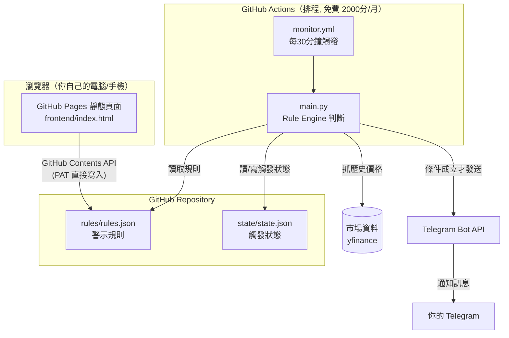

# 股票 / ETF / 指數條件警示系統（MVP）

零伺服器成本、單人使用的市場條件監控系統。
設定一次警示條件，之後每 30 分鐘自動檢查，符合條件就推 Telegram 通知。

## 系統架構



**為什麼可以做到「零伺服器成本」**：

- 沒有後端 API、沒有資料庫，所有「資料庫」就是 repo 裡的兩個 JSON 檔。
- 前端寫回規則，不是透過自架後端，而是瀏覽器直接呼叫 **GitHub Contents API**
  幫你 commit `rules.json`（細節見下方「前端如何儲存規則」）。
- 排程運算用 GitHub Actions 的免費額度（public repo 完全免費；private repo
  每月有 2,000 分鐘免費額度，這個專案每次執行只需要幾十秒，每天 48 次也綽綽有餘）。
- 狀態保存（避免重複通知）也是讓 Actions 自己 `git commit` 回 `state.json`，
  不需要額外的資料庫或 KV 服務。

---

## 專案目錄結構

```text
project/
├── frontend/                  # GitHub Pages 靜態網站（規則管理 UI）
│   ├── index.html
│   ├── style.css
│   └── app.js                 # 讀寫 GitHub Contents API、條件動態表單
│
├── scripts/                   # GitHub Actions 執行的 Python 程式
│   ├── main.py                # 進入點：串接資料源→Rule Engine→通知→狀態
│   ├── data_provider.py       # 市場資料來源抽象層（目前用 yfinance）
│   ├── notifier.py            # Telegram 發送
│   ├── state_manager.py       # state.json 讀寫 + 邊緣觸發判斷
│   ├── requirements.txt
│   └── rule_engine/           # 規則引擎（核心，詳見下方說明）
│       ├── __init__.py
│       ├── base.py            # Condition 抽象類別、RuleResult
│       ├── factory.py         # ConditionFactory（Factory Pattern）
│       └── conditions.py      # 各種條件類型的實作
│
├── rules/
│   └── rules.json             # 警示規則設定檔（前端寫、後端讀）
│
├── state/
│   └── state.json             # 每個規則目前是否已觸發（後端讀寫，避免重複通知）
│
├── .github/workflows/
│   ├── monitor.yml            # 每30分鐘跑一次 main.py
│   └── deploy-pages.yml       # frontend/ 變更時自動部署到 GitHub Pages
│
└── README.md
```

---

## rules.json 規則格式

```json
{
  "id": "taiex_ma60_deviation",
  "name": "TAIEX 60日均線乖離率 > 18%",
  "symbol": "^TWII",
  "enabled": true,
  "condition_type": "ma_deviation",
  "operator": ">",
  "value": 18,
  "params": { "ma_period": 60 },
  "notify": ["telegram"],
  "created_at": "2026-06-25T00:00:00+08:00"
}
```

完整範例（涵蓋題目要求的 5 種情境）在 [`rules/rules.json`](./rules/rules.json)。

目前支援 4 種 `condition_type`（已可組合出全部需求，見下方「條件引擎設計」）：

| condition_type | 說明 | params |
|---|---|---|
| `ma_deviation` | N日均線乖離率（也可用來表示跌破/站上均線） | `ma_period` |
| `price_change_from_base` | 相對自訂基準價的漲跌幅 % | `base_price` |
| `drawdown_from_high` | 從區間最高點回檔幅度 % | `lookback_days` |
| `rsi` | RSI 相對強弱指標 | `rsi_period` |

## state.json 狀態格式

```json
{
  "<rule_id>": {
    "is_triggered": true,
    "last_value": 213.5,
    "last_checked_at": "2026-06-25T09:40:13+08:00",
    "last_triggered_at": "2026-06-20T14:30:05+08:00"
  }
}
```

通知邊緣觸發（避免一直 spam）邏輯：

```text
第一次成立（false -> true）  → 發通知，is_triggered 設為 true
持續成立（true -> true）     → 不發通知
解除成立（true -> false）    → 重置 is_triggered = false（不發通知）
再次成立（false -> true）    → 再發一次通知
```

---

## 規則引擎（Rule Engine）設計

### 為什麼用 Factory Pattern

`rules.json` 用一個字串 `condition_type` 描述要用哪種演算法判斷，
`ConditionFactory` 負責把字串對應到實際的 `Condition` 子類別。

這個設計完全符合你的擴充需求：**新增 RSI 或 MACD 不需要修改核心程式**——

```python
# scripts/rule_engine/conditions.py，新增一個條件類型只需要這樣：

@ConditionFactory.register("macd_cross")
class MacdCrossCondition(Condition):
    min_history_days = 60

    def calculate(self, df):
        fast = df["Close"].ewm(span=12).mean()
        slow = df["Close"].ewm(span=26).mean()
        macd_line = fast - slow
        signal_line = macd_line.ewm(span=9).mean()
        return (macd_line - signal_line).iloc[-1]
```

寫完這 6 行、存檔，`rules.json` 就可以直接用 `"condition_type": "macd_cross"`，
完全不用動 `main.py`、`factory.py`、`base.py`，也不用動前端（前端的 `PARAM_SCHEMAS`
要記得補上對應欄位設定，這是唯一需要碰前端的地方）。

### 類別關係

```text
Condition (ABC)                  <- 抽象基礎類別，定義 evaluate()/compare() 共用邏輯
 ├── MaDeviationCondition         <- 60MA乖離率 / 跌破均線
 ├── PriceChangeFromBaseCondition <- 自訂基準價漲跌幅
 ├── DrawdownFromHighCondition    <- 回檔幅度
 └── RsiCondition                 <- RSI

ConditionFactory                  <- 字串 -> 類別 的對照表（@register 裝飾器自動填表）
RuleResult                        <- evaluate() 回傳的結果（triggered/current_value/message）
```

`Condition.evaluate()` 是模板方法（Template Method）：子類別只要把
「怎麼算出目前數值」（`calculate()`）寫好，「怎麼跟 threshold 比較、怎麼組訊息」
這些重複邏輯都在基礎類別處理一次就好，不用每個條件都重寫一次。

---

## Telegram 整合

1. 跟 [@BotFather](https://t.me/BotFather) 對話，`/newbot` 建立 Bot，拿到 `TELEGRAM_BOT_TOKEN`。
2. 跟你剛建立的 Bot 說一句話（隨便講），然後打開
   `https://api.telegram.org/bot<TOKEN>/getUpdates`，從回應裡找到你的 `chat.id`，
   這就是 `TELEGRAM_CHAT_ID`。
3. 到 GitHub repo 的 **Settings → Secrets and variables → Actions** 新增兩個 Secret：
   - `TELEGRAM_BOT_TOKEN`
   - `TELEGRAM_CHAT_ID`
4. `scripts/notifier.py` 會自動從環境變數讀取，`monitor.yml` 已經設定好把 Secrets
   傳進環境變數，不需要再改程式。

發送訊息範例（`scripts/notifier.py` 已實作）：

```python
import requests

def send(token, chat_id, text):
    url = f"https://api.telegram.org/bot{token}/sendMessage"
    requests.post(url, json={"chat_id": chat_id, "text": text}).raise_for_status()
```

---

## 前端如何儲存規則（沒有資料庫、沒有後端的情況下）

`frontend/index.html` 是純靜態頁面，沒有後端可以幫你寫檔案，因此採用業界常見的
「**瀏覽器直接呼叫 GitHub API 寫 commit**」做法（Netlify CMS / Decap CMS 也是這個原理）：

1. 在 GitHub 建立一個 **Fine-grained Personal Access Token**，只勾選這個 repo，
   權限只給 `Contents: Read and write`，**不要**給其他權限，並設定合理的到期日。
2. 打開部署好的 GitHub Pages 網址，在「連線設定」**只需要貼上這個 Token**——
   repo owner / repo name 會自動從目前網址（`https://{owner}.github.io/{repo}/...`）
   解析出來，預設分支也會自動呼叫 GitHub API 查詢，完全不需要手動填寫。
   Token 存在瀏覽器的 `localStorage`，不會經過任何第三方伺服器。
3. 之後「新增/編輯/刪除/啟用切換」都先在瀏覽器記憶體裡修改，按「⇪ 推送到 GitHub」
   才會一次打 `PUT /repos/{owner}/{repo}/contents/{path}` 把整份 `rules.json` 寫回 repo。

**如果你是用自訂網域（不是 `*.github.io`）部署**，自動偵測會失敗，頁面會自動展開
「進階設定」讓你手動填入 owner / repo / branch（這三個欄位平時是隱藏的，只有
真的需要覆寫時才會出現，不會干擾日常使用）。

> ⚠️ **這個方式的取捨**：Token 存在前端 localStorage，安全性低於一般有後端驗證的系統，
> 但對「只有自己用」這個前提來說是合理的權衡。如果完全不想承擔這個風險，
> 頁面上也有「複製 JSON」按鈕，可以手動把內容貼到 GitHub 網頁版編輯器存檔，
> 零風險但要手動操作。

---

## MVP 開發步驟

1. **建立 repo**，把這份專案結構推上去（`git init && git add . && git commit && git push`）。
2. **設定 GitHub Pages**：Settings → Pages → Build and deployment → Source 選
   `GitHub Actions`（因為我們用 `deploy-pages.yml` 部署 `frontend/` 目錄，
   不是用傳統的「選分支」方式）。
3. **建立 Telegram Bot**，依上方步驟拿到 Token 和 Chat ID，設成 GitHub Secrets。
4. **本地測試 Python**：
   ```bash
   cd scripts
   pip install -r requirements.txt
   export TELEGRAM_BOT_TOKEN=xxx
   export TELEGRAM_CHAT_ID=xxx
   python main.py
   ```
5. **確認 Actions 排程**正常：到 repo 的 Actions 頁面手動觸發一次 `Market Alert Monitor`
   (`workflow_dispatch`)，確認 log 沒有錯誤、`state/state.json` 有被 commit 更新。
6. **打開 GitHub Pages 網址**，在「連線設定」貼上你的 PAT（repo 資訊會自動偵測），
   確認可以讀到 `rules.json`、可以新增規則並推送回 repo。
7. 觀察一兩天，確認觸發/不重複通知/解除後再觸發的邊緣邏輯符合預期。

---

## 市場資料來源評估

| 來源 | 涵蓋範圍 | 是否需要 Key | 優點 | 缺點 | 適合 GitHub Actions? |
|---|---|---|---|---|---|
| **yfinance** | 台股/ETF (`.TW`)、上櫃 (`.TWO`)、指數 (`^TWII`)、美股 (`SPY`/`QQQ`) | 不需要 | 一個套件涵蓋這次題目所有標的；介面簡單；免費 | 非官方爬蟲、Yahoo 偶爾改版/限流；雲端 IP 有時會被暫時限速 | ✅ 可行，建議加重試機制（已實作） |
| **TWSE OpenData** | 僅上市股票 + TAIEX | 不需要 | 官方資料，準確度最高 | 不含上櫃/美股；需要自己組合多個 API、自己算技術指標；格式較雜 | ✅ 可行，但需另寫整合層；單獨用無法滿足 SPY/QQQ 需求 |
| **TPEX OpenData** | 僅上櫃股票 | 不需要 | 官方資料 | 涵蓋範圍更窄，只補上櫃 | ✅ 可行，作為 TWSE 的補充 |
| **FinMind** | 台股/上櫃整合，含財務面、籌碼面資料 | 免費額度需註冊取得 Token，否則額度很低 | 台股資料來源整合得比較統一、好用 | 不含美股；免費額度有限制；非官方機構維運 | ✅ 可行，但仍需要 yfinance 補美股 |

**推薦方案：以 `yfinance` 為 MVP 預設資料源**——因為它是唯一可以「一個介面打完
所有題目要求標的」的選項（台股、ETF、指數、美股一次搞定），最符合「先做出最簡單
可運行版本」的目標。`scripts/data_provider.py` 已經設計成抽象介面
（`DataProvider`），未來若想用 TWSE OpenData 取得更準確的台股資料當備援，
只要新增一個 `TwseProvider` 子類別並在 `main.py` 切換，不影響其他模組。

---

## 未來擴充路線圖

- **更多條件類型**：MACD 黃金/死五交叉、布林通道突破、成交量異常放大、
  連續 N 天上漲/下跌、跳空缺口。都只要照「新增條件類型」流程加新類別即可。
- **更多通知管道**：Line Notify 停用後可改用 Line Messaging API、Email（用
  GitHub Actions 內建的 SMTP action）、Discord Webhook。設計上只要在
  `notifier.py` 旁加新的 `XxxNotifier`，並讓 `rules.json` 的 `notify` 陣列
  可以填多種管道（程式已經是用陣列設計，預留了這個彈性）。
- **多重資料來源備援**：`main.py` 改成「yfinance 失敗時自動 fallback 到
  TWSE OpenData」，提升穩定性。
- **即時性提升**：如果 10 分鐘間隔不夠即時，且願意接受多一點複雜度，
  可以評估 Cloudflare Workers + Cron Triggers（一樣免費額度大方），
  比 GitHub Actions 排程更精準。
- **歷史觸發記錄**：把每次觸發 append 到一個 `history.jsonl`，前端畫一個簡單的
  時間軸，不需要資料庫。
- **規則回測**：在前端或另一個 Python script 用 `yfinance` 抓歷史資料，
  套用同一份 Rule Engine 跑過去一年的資料，估算這個規則過去會觸發幾次，
  幫助使用者調整 threshold 是否合理（Rule Engine 已經是純函式設計，
  天然就可以重複套用在歷史資料上，不需要額外開發判斷邏輯）。
- **規則啟用時間窗**：例如只在台股開盤時間 (09:00-13:30) 才檢查台股規則，
  避免休市時間浪費 Actions 額度（可以在 `rules.json` 加 `schedule_hint` 欄位，
  `main.py` 依市場時間決定要不要抓這個 symbol）。

---

## 最終實作方案總結

| 決策點 | 選擇 | 原因 |
|---|---|---|
| 資料來源 | yfinance（預留 Provider 抽象層） | 唯一能一次涵蓋台股/ETF/指數/美股的免費方案，MVP 階段複雜度最低 |
| 規則儲存 | `rules.json`（Git 即資料庫） | 完全不需要資料庫服務，版本歷史天然由 Git 提供 |
| 狀態儲存（防重複通知） | `state.json`，由 Actions 自己 commit 回 repo | 不需要 KV/Redis，邊緣觸發邏輯單純，5-6 行就能實作 |
| 條件擴充方式 | Factory Pattern + 裝飾器自動註冊 | 新增條件類型零侵入，不需要改核心程式 / 不需要 if-elif 長串判斷 |
| 排程 | GitHub Actions `schedule` cron | 免費、不需要自己維運伺服器，10 分鐘間隔對股票監控已足夠 |
| 前端儲存方式 | 瀏覽器直接呼叫 GitHub Contents API | 唯一能在「純靜態網站、無後端」前提下做到「網頁上存檔」的方式；PAT 風險已知，且提供手動複製 JSON 作為零風險備案 |
| 通知 | Telegram Bot API | 免費、設定簡單、`requests.post` 三行打完 |

這套組合的核心思路是：**把 Git repo 本身當成資料庫，把 GitHub Actions 當成運算層，
把瀏覽器 + GitHub API 當成管理介面**，剛好對應到「不要伺服器成本、不要資料庫」
的硬性限制，同時用 Factory Pattern 確保條件邏輯可以無限擴充而不用改動既有程式碼。
